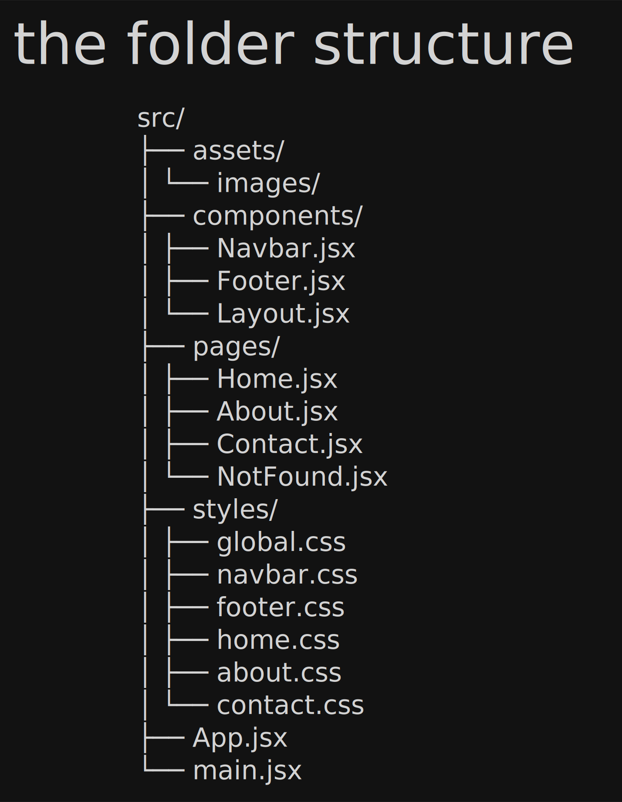

# React Portfolio Website

A simple and responsive portfolio website built with React, React Router, and CSS.

---

## Project Structure



This diagram shows the organization of the React application, including pages, components, assets, and styles.

---

## Project Screenshot


The screenshot above shows the user interface of the application running in the browser.

---

## Features

- Responsive navigation bar
- Reusable layout component
- Home page with hero section
- About page with skills and timeline
- Contact page with contact form
- Custom 404 page
- React Router navigation
- Pure CSS styling
- Mobile-friendly design

---

## Technologies Used

- React
- React Router DOM
- CSS3
- JavaScript (ES6+)
- Vite

---

## Installation

```bash
npm install
npm run dev